# Actividad 1 - API Gestión de Estudiantes
**Nombre:** Mariana Suárez

Este es un proyecto backend desarrollado con **Java 21** y **Spring Boot** para la gestión de estudiantes. Incluye una API RESTful que permite crear, leer, actualizar y eliminar (CRUD) registros de estudiantes, persistiendo los datos en una base de datos **PostgreSQL**.

## 🚀 Tecnologías Utilizadas

- **Java 21**: Lenguaje de programación.
- **Spring Boot 3.x**: Framework para el desarrollo de la aplicación.
- **Maven**: Gestor de dependencias y construcción.
- **PostgreSQL**: Base de datos relacional.
- **Lombok**: Librería para reducir el código boilerplate (Getters, Setters, etc.).
- **Spring Data JPA**: Abstracción para la capa de persistencia.

## 📋 Requisitos Previos

Asegúrate de tener instalado lo siguiente en tu entorno local:

- [Java JDK 21](https://www.oracle.com/java/technologies/downloads/#java21)
- [Maven](https://maven.apache.org/download.cgi)
- Cliente para probar la API (como [Postman](https://www.postman.com/) o [Insomnia](https://insomnia.rest/)).

## 📸 Evidencia de la Instancia en Prisma

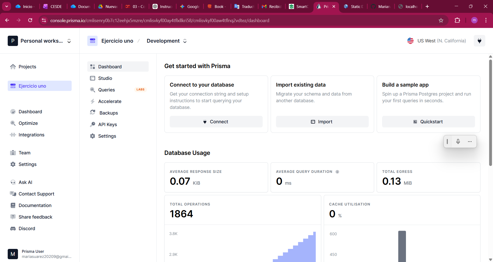

---

## 📸 Configuración de Conexión

Connection string generada desde Prisma:

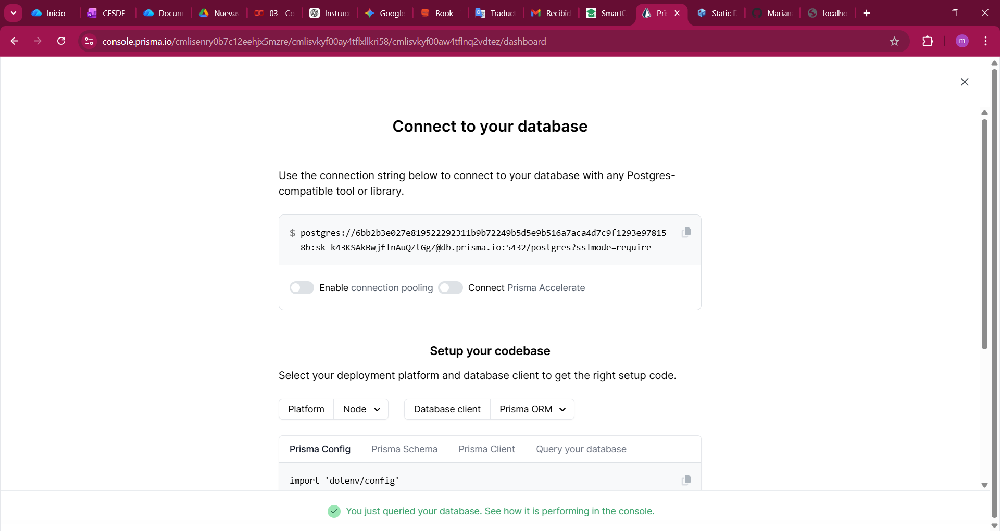


## ⚙️ Configuración

La configuración de la base de datos se maneja a través de variables de entorno definidas en un archivo `.env` en la raíz del proyecto.

1.  Copia el archivo de ejemplo:
    ```bash
    copy .env.example .env
    ```

2.  Edita el archivo `.env` y define tus credenciales:
    ```ini
    DB_URL=jdbc:postgresql://db.prisma.io:5432/postgres
    DB_USERNAME=tu_usua
    DB_PASSWORD=tu_contra

    ```

> **Nota:** El archivo `.env` está excluido del control de versiones para mantener tus credenciales seguras.

## 🛠️ Instalación y Ejecución (Windows)

1.  **Clonar el repositorio**:
    ```powershell
    git clone https://github.com/Mariana20209/26_b2_r1.git
    cd pi
    ```

2.  **Compilar el proyecto**:
    Asegúrate de estar en la raíz del proyecto y ejecuta:
    ```powershell
    .\mvnw.cmd clean install
    ```
    *Nota: Si tienes Maven instalado globalmente, puedes usar simplemente `mvn clean install`.*

3.  **Ejecutar la aplicación**:
    ```powershell
    .\mvnw.cmd spring-boot:run
    ```

    La aplicación se iniciará en el puerto `8080` (por defecto).

## 🔌 Uso de la API (Endpoints)

La API base es `/api/students`. A continuación se detallan los endpoints disponibles:

### 1. Obtener todos los estudiantes
- **Método**: `GET`
- **URL**: `/api/students`
- **Respuesta**: Lista de estudiantes en formato JSON.
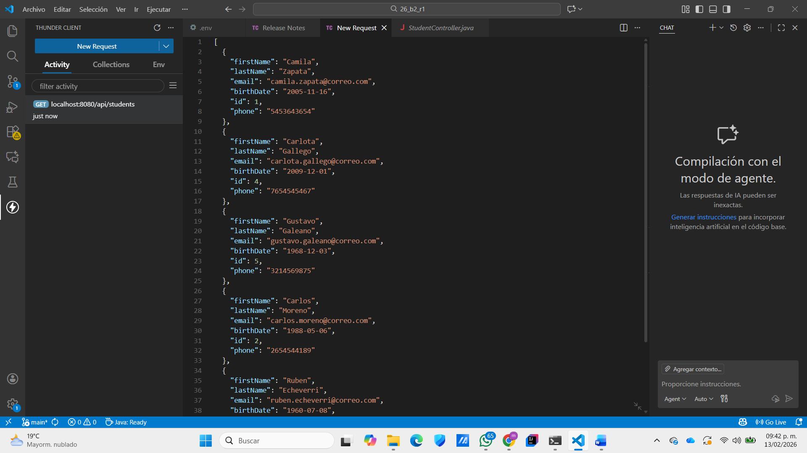

### 2. Obtener un estudiante por ID
- **Método**: `GET`
- **URL**: `/api/students/{id}`
- **Ejemplo**: `/api/students/1`
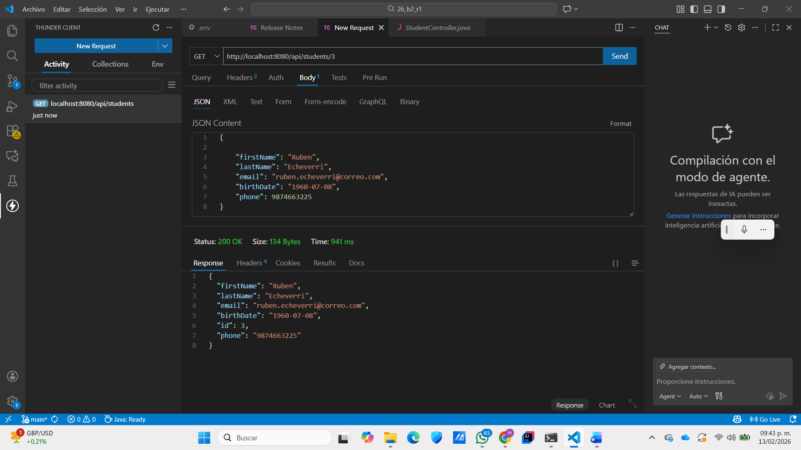

### 3. Obtener un estudiante por Email
- **Método**: `GET`
- **URL**: `/api/students/email/{email}`
- **Ejemplo**: `/api/students/email/ruben.echeverri@correo.com`
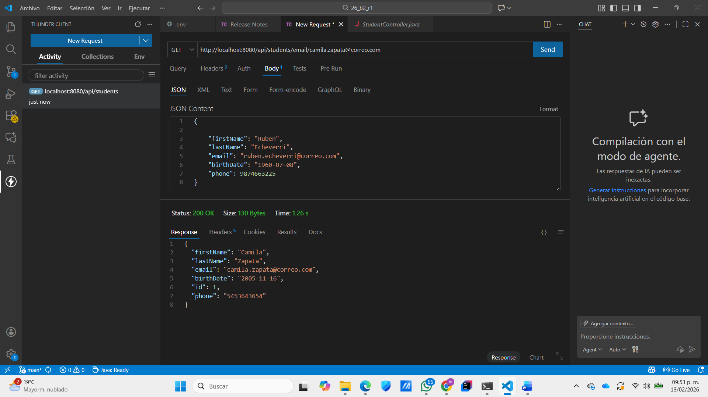

### 4. Crear un nuevo estudiante
- **Método**: `POST`
- **URL**: `/api/students`
- **Body (JSON)**:
    ```json
    {
  
    "firstName": "Ana",
    "lastName": "Vasquez",
    "email": "ana.vasquez@correo.com",
    "birthDate": "1969-04-02",
    "phone": 6556115653

    }
    ```
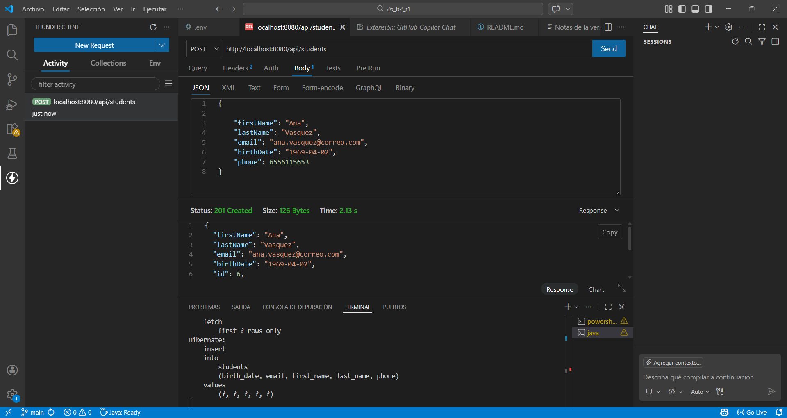

### 5. Actualizar un estudiante
- **Método**: `PUT`
- **URL**: `/api/students/{id}`
- **Ejemplo**: `/api/students/1`
- **Body (JSON)**:
    ```json
    {
      "firstName": "Ruben",
      "lastName": "Echeverri",
      "email": "ruben.echeverri@correo.com",
      "birthDate": "1960-07-08",
      "phone": "9874663225"
    }
    ```
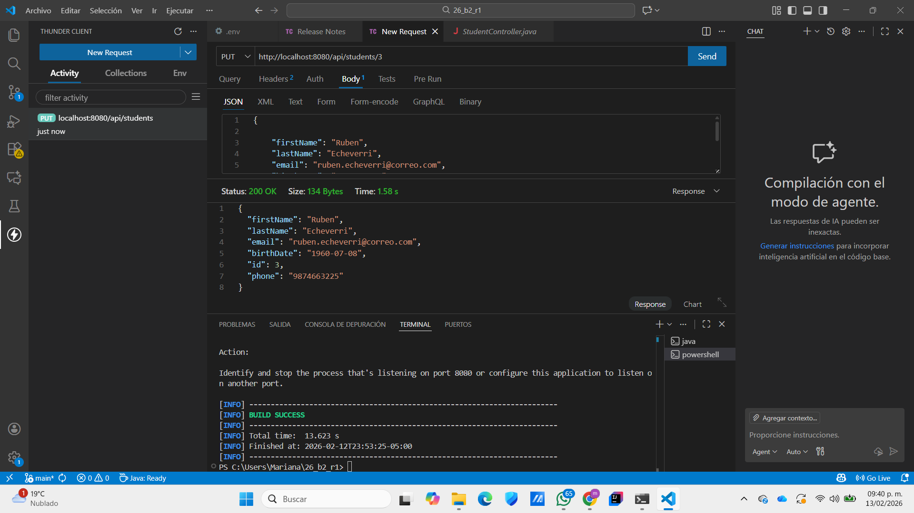

### 6. Eliminar un estudiante
- **Método**: `DELETE`
- **URL**: `/api/students/{id}`
- **Ejemplo**: `/api/students/2`
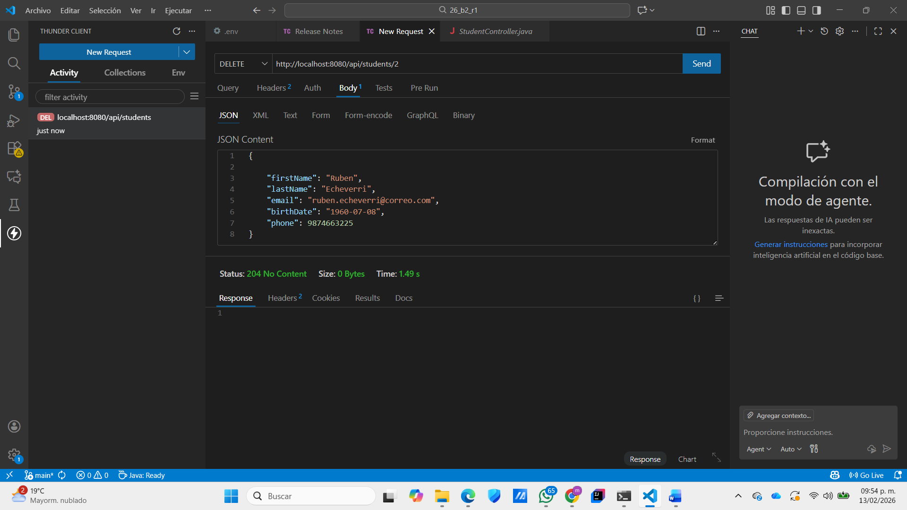

## 🧪 Ejecutar Pruebas

Para ejecutar las pruebas unitarias y de integración, usa el siguiente comando:

```powershell
.\mvnw.cmd test
```
## 📸 Evidencia de Conexión Exitosa

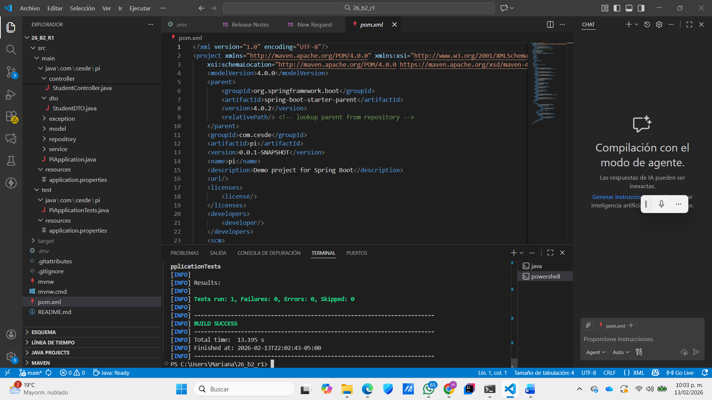

## 📸 Evidencia de Conexión mvn test

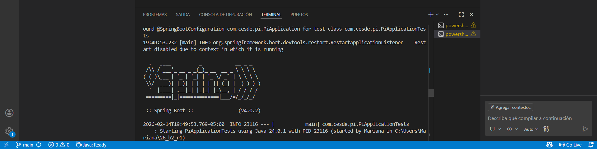

## 📸 Evidencia de logo de Spring

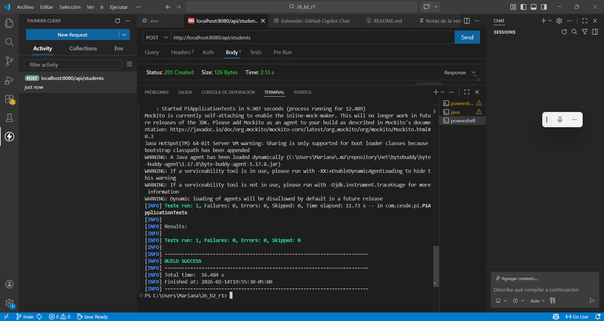

## 📂 Estructura del Proyecto

```
src/main/java/com/cesde/pi
├── controller    # Controladores REST (StudentController)
├── model         # Entidades JPA (Student)
├── repository    # Interfaces de Repositorio (StudentRepository)
├── service       # Lógica de Negocio (StudentService)
├── dto           # Objetos de Transferencia de Datos
└── exception     # Manejo de Excepciones Globales
```
